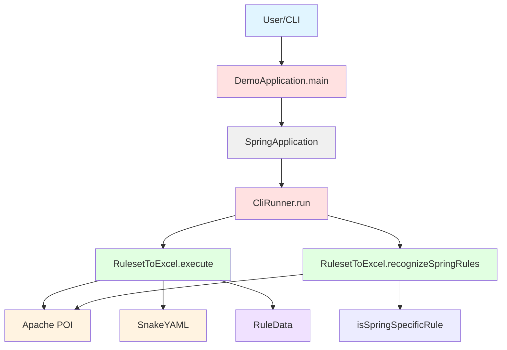

# Dependencies - Internal and External Dependency Mapping

## Overview

This document provides a comprehensive analysis of all dependencies in the AppCat Ruleset Reader, including internal code dependencies, external library dependencies, and transitive dependencies.

---

## Internal Dependencies

### Class-Level Dependencies

```
DemoApplication
├── depends on: Spring Boot Framework (annotations, SpringApplication)
├── depends on: Java Standard Library (File, List, Arrays, ArrayList)
└── contains: CliRunner (inner class)
    ├── implements: CommandLineRunner (Spring Boot)
    ├── depends on: RulesetToExcel (static method calls)
    └── depends on: System (out, err, exit)

RulesetToExcel
├── depends on: Apache POI (Excel manipulation)
├── depends on: SnakeYAML (YAML parsing)
├── depends on: Java Standard Library (File, List, Map, I/O)
└── contains: RuleData (inner class)
    └── depends on: None (standalone DTO)
```

### Method-Level Dependencies

**DemoApplication.main():**
- `SpringApplication.run()` - Spring Boot framework

**CliRunner.run():**
- `RulesetToExcel.execute()` - Utility method
- `RulesetToExcel.recognizeSpringRules()` - Utility method
- `File` constructor and methods - Java I/O
- `System.out.println()` - Console output
- `System.err.println()` - Error output
- `System.exit()` - JVM termination
- `Arrays.asList()` - Collection utilities

**RulesetToExcel public methods:**
- `XSSFWorkbook` - Apache POI
- `FileInputStream`, `FileOutputStream` - Java I/O
- `Yaml` - SnakeYAML
- Private helper methods (internal)

### Dependency Graph



---

## External Dependencies

### Direct Dependencies

#### Spring Boot Starter

**Maven Coordinates:**
```xml
<dependency>
    <groupId>org.springframework.boot</groupId>
    <artifactId>spring-boot-starter</artifactId>
    <version>Inherited from parent: 3.2.3</version>
</dependency>
```

**Purpose:** Spring Boot framework core functionality  
**Used For:**
- `@SpringBootApplication` annotation
- `SpringApplication.run()` method
- `CommandLineRunner` interface
- `@Component` annotation
- Application context management

**Classes Used:**
- `org.springframework.boot.SpringApplication`
- `org.springframework.boot.CommandLineRunner`
- `org.springframework.boot.autoconfigure.SpringBootApplication`
- `org.springframework.stereotype.Component`

**Scope:** compile (required at runtime)

#### SnakeYAML

**Maven Coordinates:**
```xml
<dependency>
    <groupId>org.yaml</groupId>
    <artifactId>snakeyaml</artifactId>
    <version>2.2</version>
</dependency>
```

**Purpose:** YAML parsing and serialization  
**Used For:**
- Parsing ruleset.yaml files
- Parsing rule YAML files
- Serializing when clauses to YAML format

**Classes Used:**
- `org.yaml.snakeyaml.Yaml`
- `org.yaml.snakeyaml.DumperOptions`
- `org.yaml.snakeyaml.DumperOptions.FlowStyle`

**Usage Locations:**
- `RulesetToExcel.processSubDirectory()` - Lines 198-204
- `RulesetToExcel.processYamlFile()` - Lines 250-252
- `RulesetToExcel.serializeWhen()` - Lines 317-324

**Configuration:**
- Flow style: BLOCK
- Indent: 2 spaces
- Pretty flow: enabled

**Scope:** compile (required at runtime)

#### Apache POI

**Maven Coordinates:**
```xml
<dependency>
    <groupId>org.apache.poi</groupId>
    <artifactId>poi</artifactId>
    <version>5.2.5</version>
</dependency>
```

**Purpose:** Excel document manipulation (core)  
**Used For:**
- Basic Excel structures (Workbook, Sheet, Row, Cell)
- Cell styles and formatting

**Classes Used:**
- `org.apache.poi.ss.usermodel.Workbook`
- `org.apache.poi.ss.usermodel.Sheet`
- `org.apache.poi.ss.usermodel.Row`
- `org.apache.poi.ss.usermodel.Cell`
- `org.apache.poi.ss.usermodel.CellStyle`
- `org.apache.poi.ss.util.WorkbookUtil`

**Scope:** compile (required at runtime)

#### Apache POI OOXML

**Maven Coordinates:**
```xml
<dependency>
    <groupId>org.apache.poi</groupId>
    <artifactId>poi-ooxml</artifactId>
    <version>5.2.5</version>
</dependency>
```

**Purpose:** Excel XLSX format support (Office Open XML)  
**Used For:**
- Creating XLSX workbooks (XSSFWorkbook)
- Reading/writing Excel 2007+ files

**Classes Used:**
- `org.apache.poi.xssf.usermodel.XSSFWorkbook`

**Usage Locations:**
- `RulesetToExcel.recognizeSpringRules()` - Line 29
- `RulesetToExcel.execute()` - Line 123

**Scope:** compile (required at runtime)

### Parent POM

**Maven Coordinates:**
```xml
<parent>
    <groupId>org.springframework.boot</groupId>
    <artifactId>spring-boot-starter-parent</artifactId>
    <version>3.2.3</version>
</parent>
```

**Purpose:** Spring Boot dependency management and build configuration  
**Provides:**
- Dependency version management (~50 managed dependencies)
- Maven plugin configurations
- Spring Boot defaults
- Java 17 configuration

---

## Transitive Dependencies

### Spring Boot Starter Transitives

The spring-boot-starter brings approximately 50+ transitive dependencies:

**Core Spring Framework (~20 dependencies):**
- spring-core
- spring-context
- spring-beans
- spring-aop
- spring-expression
- spring-jcl (logging abstraction)

**Spring Boot (~10 dependencies):**
- spring-boot
- spring-boot-autoconfigure
- spring-boot-starter-logging

**Logging (~10 dependencies):**
- logback-classic
- logback-core
- slf4j-api
- log4j-to-slf4j
- jul-to-slf4j

**Other (~10 dependencies):**
- jackson-databind (JSON)
- jackson-core
- jackson-annotations
- snakeyaml (YAML support, duplicates our explicit dependency)

### Apache POI Transitives

**Apache Commons (~5 dependencies):**
- commons-collections4
- commons-math3
- commons-io
- commons-compress

**XML Processing (~3 dependencies):**
- xmlbeans
- stax-api
- xml-apis

**Other (~5 dependencies):**
- curvesapi
- SparseBitSet

### SnakeYAML Transitives

**None** - SnakeYAML has no transitive dependencies

---

## Dependency Tree

### Complete Dependency Tree

```
com.example:demo:0.0.1-SNAPSHOT
├── org.springframework.boot:spring-boot-starter:3.2.3
│   ├── org.springframework.boot:spring-boot:3.2.3
│   ├── org.springframework.boot:spring-boot-autoconfigure:3.2.3
│   ├── org.springframework.boot:spring-boot-starter-logging:3.2.3
│   │   ├── ch.qos.logback:logback-classic:1.4.14
│   │   ├── org.apache.logging.log4j:log4j-to-slf4j:2.21.1
│   │   └── org.slf4j:jul-to-slf4j:2.0.9
│   ├── org.springframework:spring-core:6.1.4
│   ├── org.springframework:spring-context:6.1.4
│   └── org.yaml:snakeyaml:2.2
├── org.yaml:snakeyaml:2.2 (explicit declaration)
├── org.apache.poi:poi:5.2.5
│   ├── commons-codec:commons-codec:1.16.0
│   ├── commons-collections:commons-collections4:4.4
│   ├── commons-io:commons-io:2.15.1
│   ├── commons-math3:commons-math3:3.6.1
│   ├── com.zaxxer:SparseBitSet:1.3
│   └── org.apache.logging.log4j:log4j-api:2.21.1
└── org.apache.poi:poi-ooxml:5.2.5
    ├── org.apache.poi:poi:5.2.5 (already listed)
    ├── org.apache.poi:poi-ooxml-lite:5.2.5
    ├── org.apache.xmlbeans:xmlbeans:5.2.0
    ├── org.apache.commons:commons-compress:1.25.0
    └── com.github.virtuald:curvesapi:1.08
```

---

## Version Compatibility Matrix

### Java Version Requirements

| Dependency | Minimum Java | Recommended Java | Our Version |
|------------|--------------|------------------|-------------|
| Spring Boot 3.2.3 | Java 17 | Java 17 | Java 17 ✅ |
| Apache POI 5.2.5 | Java 8 | Java 11+ | Java 17 ✅ |
| SnakeYAML 2.2 | Java 8 | Java 11+ | Java 17 ✅ |

**Assessment:** All dependencies compatible with Java 17 ✅

### Cross-Dependency Compatibility

| Dependency A | Dependency B | Compatible | Notes |
|--------------|--------------|------------|-------|
| Spring Boot 3.2.3 | Apache POI 5.2.5 | ✅ Yes | No conflicts |
| Spring Boot 3.2.3 | SnakeYAML 2.2 | ✅ Yes | Spring includes SnakeYAML 2.2 |
| Apache POI 5.2.5 | SnakeYAML 2.2 | ✅ Yes | No interaction |

**Duplicate Dependencies:**
- SnakeYAML 2.2 is both explicitly declared and transitively included from Spring Boot
- Resolution: Maven uses explicit declaration (same version, no conflict)

---

## Dependency Analysis

### Dependency Usage Intensity

| Dependency | Lines of Code Using | % of Codebase | Criticality |
|------------|---------------------|---------------|-------------|
| Apache POI | ~150 lines | ~29% | HIGH - Core functionality |
| SnakeYAML | ~50 lines | ~10% | HIGH - Core functionality |
| Spring Boot | ~30 lines | ~6% | MEDIUM - Framework only |
| Java I/O | ~80 lines | ~15% | HIGH - File operations |
| Java Collections | ~40 lines | ~8% | MEDIUM - Data structures |

### Coupling Analysis

**Tight Coupling:**
- ✗ Apache POI classes used directly throughout RulesetToExcel
- ✗ SnakeYAML Yaml class used directly for parsing
- ✗ No abstraction layer for external libraries

**Loose Coupling:**
- ✓ Spring Boot framework loosely coupled (only annotations and bootstrap)
- ✓ Java standard library (acceptable tight coupling)

**Recommendation:** Add abstraction layers for Apache POI and SnakeYAML to improve testability and enable future library replacements.

---

## Dependency Security

### Known Vulnerabilities

**Status as of 2026-02-12:** (Requires actual vulnerability scan)

**Recommended Tools:**
- OWASP Dependency-Check
- Snyk
- GitHub Dependabot
- Maven dependency:analyze

### Dependency Age

| Dependency | Release Date | Age | Status |
|------------|--------------|-----|--------|
| Spring Boot 3.2.3 | Feb 2024 | ~2 years | Newer versions available |
| Apache POI 5.2.5 | Dec 2023 | ~2 years | Newer versions available |
| SnakeYAML 2.2 | Sep 2023 | ~2+ years | Newer versions available |

**Recommendation:** Check for newer versions with security fixes.

---

## Dependency Upgrade Paths

### Spring Boot

**Current:** 3.2.3  
**Latest 3.x:** 3.3.x+  
**Upgrade Path:**
1. 3.2.3 → 3.2.latest (patch updates, safe)
2. 3.2.latest → 3.3.x (minor update, review breaking changes)

**Breaking Changes:** Review Spring Boot 3.3 release notes

### Apache POI

**Current:** 5.2.5  
**Latest 5.x:** 5.3.x+  
**Upgrade Path:**
1. 5.2.5 → 5.2.latest (patch updates, safe)
2. 5.2.latest → 5.3.x (minor update, test thoroughly)

**Breaking Changes:** Unlikely in minor versions

### SnakeYAML

**Current:** 2.2  
**Latest 2.x:** 2.3+  
**Upgrade Path:**
1. 2.2 → 2.3 or later (check CVEs)

**Note:** SnakeYAML has had security vulnerabilities in past versions. Keep updated.

---

## Unused Dependencies

### Analysis of Declared Dependencies

**All declared dependencies are used:**
- ✅ spring-boot-starter: Used for CommandLineRunner, annotations
- ✅ snakeyaml: Used for YAML parsing
- ✅ poi: Used for Excel manipulation (core)
- ✅ poi-ooxml: Used for XLSX format

**However, many transitive Spring Boot features are unused:**
- ✗ Web server (Tomcat) - CLI application doesn't need web server
- ✗ Actuator endpoints - Configured but unnecessary for CLI
- ✗ Jackson JSON - Not used for JSON processing
- ✗ Many Spring modules - Auto-configuration brings unnecessary components

**Recommendation:** Consider using spring-boot-starter-parent without spring-boot-starter for leaner dependency tree, manually add only required Spring components.

---

## Dependency Properties

### Maven Properties

Defined in pom.xml:

```xml
<properties>
    <java.version>17</java.version>
    <apache.poi.version>5.2.5</apache.poi.version>
    <snakeyaml.version>2.2</snakeyaml.version>
</properties>
```

**Benefits:**
- Centralized version management
- Consistent versions across modules (if multi-module in future)
- Easy version updates

---

## Dependency Scope Analysis

### All Dependencies Use Compile Scope

| Dependency | Declared Scope | Effective Scope | Correct? |
|------------|----------------|-----------------|----------|
| spring-boot-starter | (default compile) | compile | ✅ Yes |
| snakeyaml | (default compile) | compile | ✅ Yes |
| poi | (default compile) | compile | ✅ Yes |
| poi-ooxml | (default compile) | compile | ✅ Yes |

**Test Scope Missing:**
- ✗ No test dependencies declared
- ✗ No JUnit, Mockito, or testing frameworks
- Recommendation: Add spring-boot-starter-test with test scope

---

## Classpath Analysis

### Runtime Classpath

**JAR Size Breakdown (estimated):**
- Spring Boot and Spring Framework: ~8-10 MB
- Apache POI and dependencies: ~15-20 MB
- SnakeYAML: ~0.3 MB
- Application classes: ~0.05 MB
- **Total Executable JAR:** ~25-30 MB

**Startup Impact:**
- Spring Boot context initialization: ~2-3 seconds
- Application code execution: < 1 second for typical use
- **Total startup time:** ~2-4 seconds

---

## Build Plugin Dependencies

### Maven Plugins

#### Spring Boot Maven Plugin

```xml
<plugin>
    <groupId>org.springframework.boot</groupId>
    <artifactId>spring-boot-maven-plugin</artifactId>
</plugin>
```

**Purpose:**
- Package executable JAR with dependencies
- Repackage with Spring Boot loader
- Enable java -jar execution

**No additional dependencies declared**

---

## Dependency Recommendations

### Immediate Actions

1. **Add Test Dependencies:**
   ```xml
   <dependency>
       <groupId>org.springframework.boot</groupId>
       <artifactId>spring-boot-starter-test</artifactId>
       <scope>test</scope>
   </dependency>
   ```

2. **Check for Security Updates:**
   - Run `mvn dependency:analyze`
   - Run `mvn versions:display-dependency-updates`
   - Review CVE databases for current versions

3. **Remove Unused Features:**
   - Disable server configuration in application.properties
   - Disable actuator endpoints
   - Disable DevTools in production builds

### Future Improvements

1. **Consider Lighter Framework:**
   - Evaluate PicoCLI or JCommander vs Spring Boot for CLI
   - Potential JAR size reduction from 25MB to 5MB

2. **Add Dependency Abstractions:**
   - Create ExcelWriter interface abstracting Apache POI
   - Create YamlParser interface abstracting SnakeYAML
   - Improve testability and future library swapping

3. **Dependency Injection:**
   - Use Spring DI instead of static methods
   - Better testing with mocked dependencies

---

## Related Documentation

- **[Components](components.md)** - How components use these dependencies
- **[Program Structure](../reference/program-structure.md)** - Import statements and usage
- **[Maven Configuration](../specialized/maven/dependency-management.md)** - Detailed Maven configuration
- **[Technical Debt](../technical-debt/outdated-components.md)** - Dependency-related technical debt

---

*Dependency information extracted from pom.xml and static code analysis. For current vulnerability status, run security scanning tools against the codebase.*
