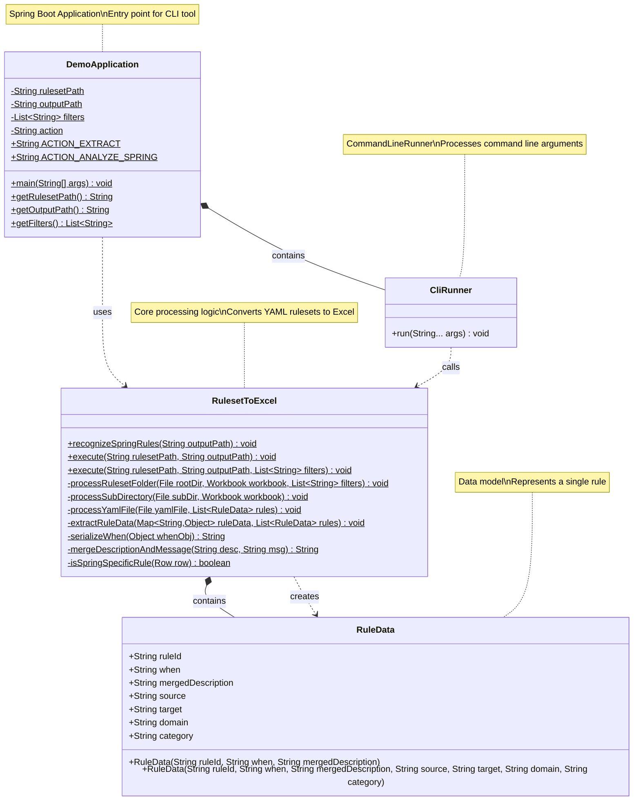

# Class Diagram - Appcat Ruleset Reader

## Component Overview

### **DemoApplication**
- **Type**: `@SpringBootApplication`
- **Purpose**: Main entry point for the Spring Boot CLI application
- **Key Responsibilities**:
  - Manages command-line argument parsing
  - Stores application configuration (rulesetPath, outputPath, filters, action)
  - Defines supported actions (extract, analyze-spring)

### **CliRunner** 
- **Type**: `@Component`, implements `CommandLineRunner`
- **Purpose**: Executes application logic after Spring Boot startup
- **Key Responsibilities**:
  - Parses command-line arguments (rulesetpath, outputpath, filters, action)
  - Validates input parameters and directories
  - Delegates to RulesetToExcel based on action type

### **RulesetToExcel**
- **Type**: Utility class with static methods
- **Purpose**: Core business logic for processing rulesets
- **Key Responsibilities**:
  - **Extract action**: Reads YAML ruleset files and generates Excel workbook
  - **Analyze-spring action**: Analyzes rules to identify Spring-specific patterns
  - Processes directory structures, YAML files, and Excel sheets
  - Creates and formats Excel output with rule data

### **RuleData**
- **Type**: Inner static class (data model)
- **Purpose**: Represents a single migration rule
- **Properties**:
  - ruleId: Unique identifier
  - when: Conditional logic
  - mergedDescription: Combined description and message
  - source: Source technology label
  - target: Target technology label
  - domain: Domain classification
  - category: Category classification

## Relationships

- **DemoApplication contains CliRunner**: Inner static component class
- **DemoApplication uses RulesetToExcel**: Calls static methods based on action
- **CliRunner calls RulesetToExcel**: Invokes execute() or recognizeSpringRules()
- **RulesetToExcel creates/contains RuleData**: Instantiates RuleData objects while processing YAML files

## Dependencies

- **Spring Boot 3.2.3**: Application framework
- **Apache POI 5.2.5**: Excel file manipulation
- **SnakeYAML 2.2**: YAML parsing
