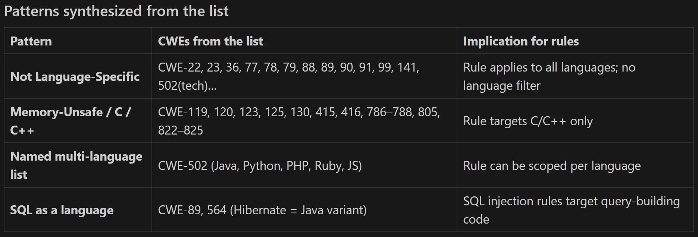

Steps:
1. get the CWE ID list from ISO5055.
2. paste into Excel to remove duplicate via: =UNIQUE(A:A)
3. replace the content of cwe-list.md with the new ID list.
4. run extract-cwe.ps1
5. get the csv file.

language patterns as below (note: if no Languages field on the page, set as empty)
